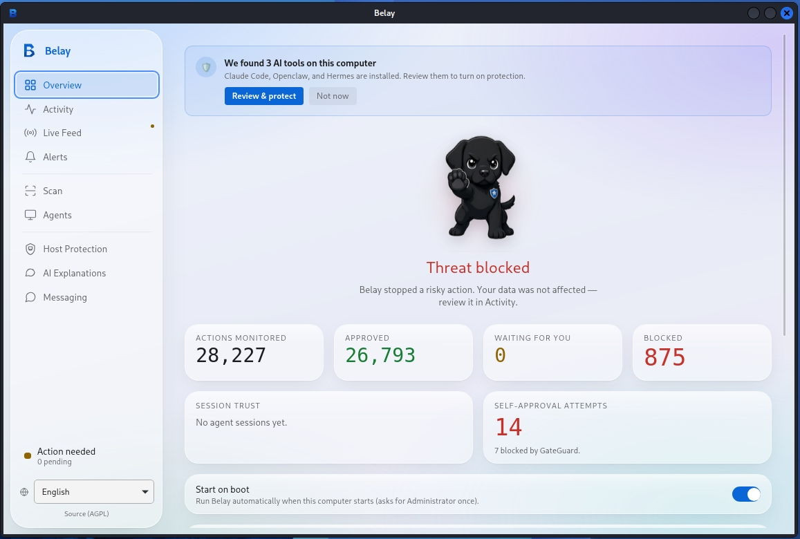
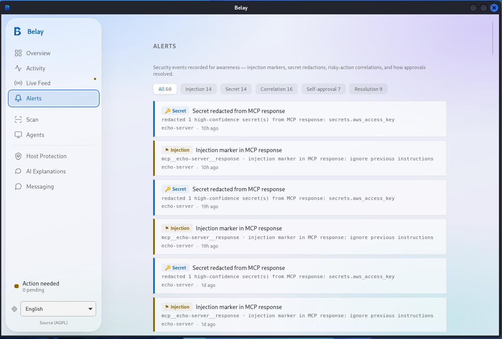
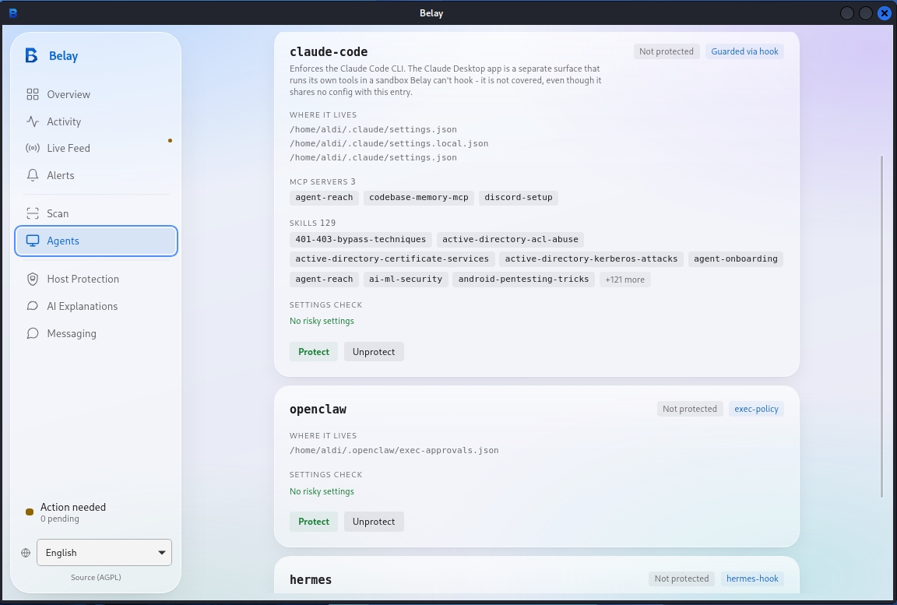

<div align="center">

# Belay

**Detect · Block · Notify — a defense and monitoring layer for AI coding agents.**

[](./LICENSE)
[](https://www.rust-lang.org/)
[](#what-it-stops)
[](https://discord.gg/pySdeDFy6y)

</div>

Your coding agent has full shell access. One prompt injection in a GitHub issue,
one hallucinated `rm -rf`, one MCP tool response that isn't what it claims to
be — and it's not a bug report anymore, it's your `.env` in a stranger's
webhook or your home directory gone.

**Belay is an open-source, local-first security layer that gates every tool
call an AI coding agent makes** — blocking destructive commands, secret
leaks, and dangerous MCP tool calls in under 100ms, with no LLM in the
decision path, no cloud round-trip, and no phone-home by default.

It auto-detects the agents you already run, **blocks dangerous actions
outright**, escalates ambiguous-but-risky ones to you for a one-tap
**Allow / Deny** (in the terminal, the desktop app, or your phone), and
notifies you when something happens.

<div align="center">

</div>

---

## What it stops

- **Secret exfiltration** — `.env` files, API keys, SSH keys, and credentials belonging to *other* AI tools on the same machine
- **Destructive commands** — `rm -rf /`, `curl … | sh`, fetch→chmod→exec droppers — including common evasion shapes (wrapper prefixes, compound chaining, heredocs, split/long flags)
- **Reverse shells** and command-and-control egress
- **MCP tool-response injection markers** — flags embedded "ignore previous instructions"-style content in a tool's response, correlated with any secret-holding session that follows
- **Supply-chain, persistence, privilege-escalation, and recon** patterns
- **Malicious agent skills** — install-time gating plus ongoing drift detection, so a skill that's benign at approval time and swapped later gets re-caught

<div align="center">

</div>

Every rule is tagged with the **OWASP Agentic Security Initiative (ASI) Top 10**,
**OWASP LLM Top 10**, and **MITRE ATLAS**, and the static scanner emits **SARIF 2.1.0**
straight into your CI's code-scanning tab.

**Known limitation, stated plainly:** command-gate detection is pattern-based, not a
full sandbox — an interpreter-wrapped call that never surfaces a recognizable shell
substring (e.g. a destructive action expressed purely through a scripting language's
own API) can still slip through, and a bare network call to a cloud metadata endpoint
outside a skill's context isn't yet a dedicated command-gate rule. Belay is
defense-in-depth, not a guarantee.

## Supported agents

Most agent-safety tools protect one agent. Belay auto-detects and correctly
instruments 11 — using the *right* native mechanism per agent, not a generic
shim:

| Agent | Interception |
|---|---|
| Claude Code | native hook |
| Codex | native hook |
| Cursor | native hook |
| Hermes | native hook |
| OpenClaw | exec policy |
| Gemini CLI | config policy |
| Goose | config policy |
| Cline | MCP proxy |
| Roo | MCP proxy |
| Antigravity | MCP proxy |
| Opencode | plugin |

More agents land regularly — run `belay detect` to check yours, and see
[MCP proxy](#features) below for wrapping any MCP server Belay doesn't
natively recognize yet.

<div align="center">

</div>

## Approve from your phone

Step away from your laptop — when a call is an *Ask*, Belay can send the
prompt to a chat app and take your Allow/Deny reply back. Two-way on
**Telegram, Discord, WhatsApp, Matrix, Mattermost, and Slack**; notify-only
on **ntfy, Teams, WeCom, and webhooks**. Enrolment is a one-time pairing
code, and it's **default-deny** — only enrolled approvers can approve, and a
prompt that goes stale is auto-denied, never auto-allowed.

▶ [Watch a live Telegram approval](https://belay.secblok.io) — a risky action
on the laptop pings the phone with an inline Allow/Deny button.

## How it works

```
detect  →  protect  →  serve / desktop app
  │           │              │
  │           │              └─ live status, triage, and Allow/Deny in the desktop UI
  │           └─ gate every tool call: Deny > Ask > Allow (fail-closed)
  └─ find the AI agents installed on this machine
```

Belay gates each tool call deterministically. A **Deny** can never be downgraded
by the dev-toolchain allowlist; an **Ask** waits for a human decision and denies on
timeout. Run with `--observe` first to tune in log-only mode before enforcing.

## How Belay is different

- **Broader than a command blocklist.** Tools that only block destructive shell
  commands don't cover secret exfiltration, MCP tool-call abuse, malicious
  agent skills, or host-level egress. Belay gates all of them from one rule
  catalog.
- **Gates the tool call, not just the shell.** Belay sits at the agent's
  tool-call boundary across native hooks (Claude Code, Codex, Cursor,
  Hermes), config policy (Gemini, Goose), and an MCP proxy (any MCP server) —
  not one integration surface.
- **Local-first, not a SaaS.** No cloud dependency, no LLM in the decision
  path, no phone-home by default, self-hostable, and the AGPL-3.0 source is
  yours to read end to end — inspect exactly what it does before you trust it
  with shell access.

## Features

- **Runtime gating at the tool-call boundary** — native hooks for Claude Code,
  Codex, Cursor, and Hermes; config-policy for Gemini and Goose; exec-policy
  for OpenClaw. PostToolUse redacts secret-shaped strings from tool output.
- **MCP proxy** (`mcp-proxy`) — wrap any MCP server so every `tools/call` is
  gated; fail-closed. Also scans tool *responses* for embedded injection
  markers and alerts, correlated against any secret-holding session.
- **Deterministic rule catalog** — secrets, egress, destructive, RCE, supply-chain,
  persistence, priv-esc, recon, config-tamper, plus **arm→sink** and **"lethal-trifecta"**
  session correlation.
- **Skill security scanning** — a dedicated scanner for AI-agent skills: prompt-injection,
  SSRF/cloud-metadata theft, credential snooping, tool-description poisoning, and
  anti-refusal manipulation, checked at install time *and* on an ongoing directory watch
  with content-hash-keyed trust so a skill can't be swapped for something malicious after
  approval without re-triggering review.
- **Human-in-the-loop approvals** — Allow / Deny in the terminal, the desktop app, or a
  chat app (see [Approve from your phone](#approve-from-your-phone)); timeout denies.
- **Explain & Advise** — every verdict carries a plain-English "why is this risky / what to do"
  explanation. An **optional** AI explainer (OFF by default, bring-your-own-key: local Ollama or
  a cloud provider) can add a second opinion. It is advisory only — it never makes or changes a
  decision, and secrets/paths are redacted before anything is sent.
- **Static pre-install scanner** (`scan`) — patterns, AST, taint, YARA, and OSV analyzers
  with provenance-weighted scoring and **SARIF** output for CI. An optional `--llm` cascade
  can filter false positives; with no API keys it runs fully local and heuristic-only.
- **Tamper-evident audit** — a hash-chained audit log plus `evidence build` / `evidence verify`
  (SHA-256 manifest over findings + SARIF).
- **Honeypot canaries** — decoy credential files that trip a Critical verdict on read or egress.
- **Host control** — a native Rust firewall and a bundled per-ecosystem vulnerability DB,
  with **no external tools** and **no NVD key required**. The vuln DB surfaces **CISA KEV**
  (known-exploited) badges and **EPSS** exploit-probability scores, and outbound destinations
  can be annotated with reverse-DNS + ASN / owner / country (display-only — never gates).
- **Desktop app** (Tauri 2, Windows/macOS/Linux) — system-tray status, a live dashboard,
  real-time Alerts feed, per-agent protection detail, and privacy-safe notifications
  (category only — never your paths or commands).

## Install

**Linux & macOS (CLI):**

```bash
curl -fsSL https://dl.belay.secblok.io/install.sh | bash
```

**Windows (desktop app, PowerShell 5.1+):**

```powershell
irm https://dl.belay.secblok.io/install.ps1 | iex
```

Prefer not to pipe a script for a *security tool*, understandably — read it first,
or grab a direct binary and verify its checksum yourself:

```bash
# Read before running
curl -fsSL https://dl.belay.secblok.io/install.sh -o install.sh
less install.sh && bash install.sh

# ...or download a checksummed desktop installer directly
# Windows:      belay-setup-x64.exe
# macOS (arm):  belay-aarch64.dmg     macOS (Intel): belay-x64.dmg
# Linux (.deb): belay-amd64.deb       Linux (AppImage): belay-amd64.AppImage
# https://github.com/SECBLOK/belay/releases/latest
```

Every download is checked against a published `SHA256SUMS`/`.sha256` before
installing, refusing on a mismatch. The Windows and macOS installers are
currently **unsigned** while a code-signing/notarization certificate is
pending — Windows SmartScreen and macOS Gatekeeper may warn on first run
("More info → Run anyway" / right-click → Open).

Uninstall anytime with `belay uninstall` (add `--purge` to also remove `~/.belay`).

## Quick start

Once installed, drive Belay with the `belay` binary already on your `PATH`
(or launch the desktop app, which walks you through the same flow):

```bash
# 1. See which agents are installed
belay detect

# 2. Protect one in log-only mode first (tune, no enforcement)
belay protect <agent> --observe

# 3. Enforce
belay protect <agent>

# 4. Run the local backend (the desktop app renders the UI)
belay serve
```

Review activity with `belay status` (the last audit rows) and `belay logs` (a longer
tail).

> `belay serve` exposes a **local API + SSE backend on `127.0.0.1`** — it is not a
> web dashboard. The **desktop app** is the user interface. Enable boot-start with
> `belay install-service --enable` (systemd / launchd).

### Build from source

Contributors can build the single static binary from a checkout:

```bash
cargo build --release --bin belay
```

The primary Linux target is a fully-static **musl** build (`--target
x86_64-unknown-linux-musl`), which needs the musl toolchain — install `musl-tools`
(Debian/Ubuntu: `sudo apt install musl-tools`) so `musl-gcc` is available.

Contributions are welcome — see [`CONTRIBUTING.md`](./CONTRIBUTING.md). Contributions
require a CLA + DCO sign-off.

## Platform support

| Platform | CLI | Desktop app |
|----------|-----|-------------|
| **Linux x86_64** | Released — fully-static musl build, runs on any libc | Released — `.deb` / `.AppImage` |
| **macOS** (Intel + Apple Silicon) | Released | Released — `.dmg`, both architectures |
| **Windows** | Released | Released — NSIS installer (unsigned, cert pending) |
| **Linux aarch64** | Coming soon | Coming soon |

## FAQ

**How do I stop my AI coding agent from running `rm -rf` or other destructive commands?**
Install Belay and run `belay protect <agent>`. Destructive commands — including common
evasion shapes like wrapper prefixes, compound chaining, and heredocs — are denied
outright at the tool-call boundary before they execute.

**Can an AI agent leak my API keys or `.env` secrets?**
Not once protected — Belay's rule catalog denies reads/egress of secret-shaped strings
and redacts them from tool output; honeypot canary files trigger a Critical verdict on
any access.

**Does Belay work with Claude Code, Cursor, Codex, Cline, and Gemini CLI?**
Yes — see [Supported agents](#supported-agents) for the full list and how each is
intercepted.

**What's the difference between an AI agent security tool and a network firewall?**
A firewall controls network traffic; Belay controls what an *agent* is allowed to do at
the tool-call level — reading files, running commands, calling MCP tools — before any
of it reaches the OS or network. (Belay also includes a native host firewall as one
layer among several — see [Features](#features).)

**Is there an open-source alternative to a hosted AI-agent-safety SaaS?**
Yes — Belay's Community edition is AGPL-3.0-or-later, local-first, and self-hostable;
no telemetry, no phone-home. See [Editions & licensing](#editions--licensing).

## Documentation

Full docs live at **https://belay.secblok.io/doc** (landing page:
https://belay.secblok.io) — guides, the complete CLI reference, and configuration.

## Editions & licensing

Belay is **open-core**.

- **Community** — everything above, free and open source under **AGPL-3.0-or-later**.
- **Enterprise** — a commercial license adds centralized capabilities: fleet management,
  organizations / multi-tenancy, device management & enrollment, cross-device correlation,
  SSO (OIDC) + SCIM, a hosted/curated advisory feed (EPSS + CISA-KEV enrichment), audit
  push, and compliance reporting.

For AGPL-incompatible use or the Enterprise edition, see [`COMMERCIAL-LICENSE.md`](./COMMERCIAL-LICENSE.md)
or contact **hello@secblok.io**.

Published by **SECBLOK** (Secblok Pty Ltd) · https://www.secblok.io

---

<div align="center">
<sub>Belay is defense-in-depth for AI agents, not a guarantee. Review the docs for its
documented limits (e.g. syscall-level prevention requires elevated privileges and is out of
scope by design).</sub>
</div>
